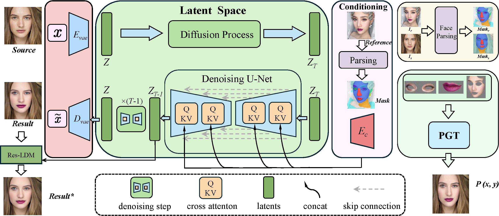

# BeautyDiffusion: Latents Decoupling in Makeup Transfer Diffusion Semantics


# Method



Overview of the proposed BeautyDiffusion model for makeup transfer. Our method leverages a diffusion-based framework with integrated facial parsing and makeup embedding modules to enable precise and controllable makeup application. By utilizing a conditional diffusion process, BeautyDiffusion avoids the need for adversarial training and paired datasets, producing high-fidelity results even in cases of significant spatial misalignment. The Makeup Condition Encoder extracts parsed facial features, integrating them into a latent space representation, while the Makeup Transfer Mechanism facilitates interaction between latent spaces, makeup conditions, and pseudo ground truth supervision. This framework effectively reconstructs facial features and makeup details from noise, achieving stable and rapid makeup transfer with minimal dataset requirements

## Getting Started

1. Clone repo

```
git clone https://github.com/hefengcs/BeautyDiffusion.git
cd BeautyDiffusion
```

2. Create conda environment.
   If you already have an `ldm` environment installed according to [LDM](https://github.com/CompVis/latent-diffusion#requirements), you do not need to go throught this step (i.e., step 2). You can simply `conda activate ldm` and jump to step 3.

```
 conda env create -f environment.yaml
 conda activate codiff
```

3. Install dependencies

   ```
    pip install transformers==4.19.2 scann kornia==0.6.4 torchmetrics==0.6.0
    conda install -c anaconda git
    pip install git+https://github.com/arogozhnikov/einops.git
   ```

## Download

1. Download the pre-trained models from [Google Drive](https://drive.google.com/file/d/10Y3vao6z1KBXC0lNRuRjDU55AlkkX7CA/view?usp=sharing) 

2. Put the models under `pretrained` as follows:

   ```
   BeautyDiffusion
   └── pretrained
       ├── BeautyDiffusion.ckpt
       ├── 256_mask.ckpt
   ```

   

### Training

```
python main.py --train
```


### Inference

```
python main.py --no-test
```
